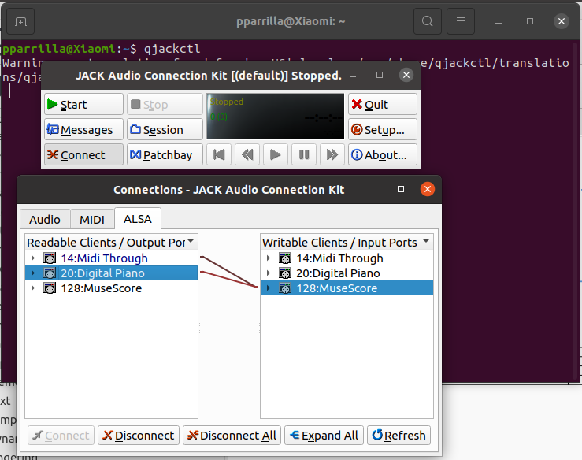
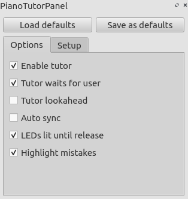
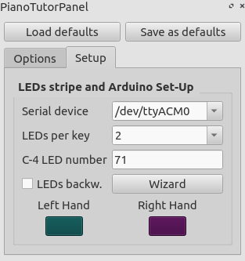

# Build process

## Clone the repository

First of all, clone the piano-tutor branch:

```
git clone -b piano-tutor https://github.com/pparrilla/MuseScore.git
```
## Load .ino file to Arduino

Now you need to load the .ino file located in MuseScore/miditools/PianoTutor/PianoTutor.ino in your Arduino.

If you want to use my project, you need an Arduino Leonardo, or another 32u4 board, that can use Keyboard.h library. It's
located in MuseScore/miditools/PianoTutor/PianoTutorButtons. And for compile, you need to copy ButtonSMP to your Arduino Library.

To check if it's working, you can use Serial Monitor an select 115200 as serial port. If it show a message like "Piano Tutor..."
it's okay.

For test the light strip, you can write `h10101010` in the serial Monitor, and the led will be on. For turn off just write `h10000000`.

You must to close the Arduino program because if you dont, MuseScore couldn't read and write from the Serial.

## Install

After that, we need some MuseScore build dependencies:

```bash
sudo apt-get build-dep musescore

sudo apt-get install cmake-qt-gui qtwebengine-dev

# For sound dependicies
sudo apt-get install alsa-tools qjackctl
```

Finally, compile the program:

```
make

sudo make install
```

## Running MuseScore

In MuseScore we need to select ALSA audio in the Preferences *(Edit->Preferences->I/O)* and enable MIDI input *(Edit->Preferences->Note Input)*

Connect your MIDI using qjackctl, running it using terminal:



Now you can open MuseScore, and with shortcut `'T'` appear Piano-Tutor panel:


